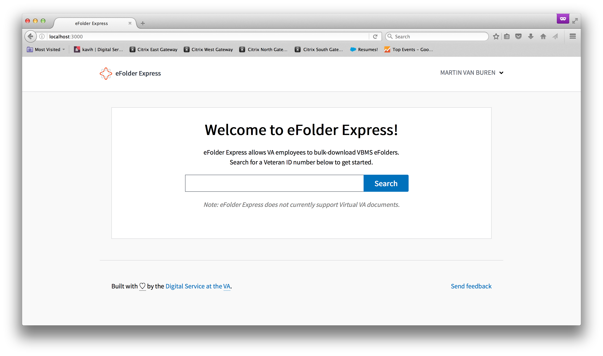

# Caseflow - eFolder Express
[](https://travis-ci.org/department-of-veterans-affairs/caseflow-efolder)

## About

FOIA Requests that give veterans access to their own VA files take **way** too long right now. eFolder Express allows VA employees to download all of a veteran's files in a fraction of the time it currently takes. It will also enable attorneys in the appeals process to use best-in-class legal tools to review these documents and so they can provide excellent service to America's veterans.



## Start up your docker based environment

**This guide may make assumptions that you have possibly already setup [Caseflow](https://github.com/department-of-veterans-affairs/caseflow).**

We use [docker](https://docs.docker.com/) and [docker-compose](https://docs.docker.com/compose/) to mock a production Renvironment locally.  Prior knowledge of docker is not required, but slowly learning how docker works is encouraged.
Please ask a team member for an overview, and/or slowly review the docs linked.

Your development setup of caseflow currently runs Redis, postgres and OracleDB (VACOLS) in Docker.

1. Setup your postgres user.  Run this in your CLI, or better yet, add this to your shell configuration `~/.zshrc` or 

```
export POSTGRES_HOST=localhost
export POSTGRES_USER=postgres
export POSTGRES_PASSWORD=postgres
```

2. Copy Makefile.example into your own Makefile so you have easy access to common commands
```
ln -s Makefile.example Makefile
```

3. Start all containers
```
make up

docker-compose ps
# this shows you the status of all of your dependencies
```

If on M1 or M2 Mac:
```
make up-m1
```

Make sure to run `make down` in caseflow repo directory before running this or update ports in the docker-compose.yml to match. This is because Caseflow eFolder and Caseflow expect postgresql to be running on different ports.

4. Turning off dependencies
```
# this stops all containers
make down

# this will reset your setup back to scratch. You will need to setup your database schema again if you do this (see below)
docker-compose down -v
```

## First Time Development Setup

**This guide may make assumptions that you have possibly already setup [Caseflow](https://github.com/department-of-veterans-affairs/caseflow).**

1. [Make sure basic dependencies are setup](https://github.com/department-of-veterans-affairs/caseflow#basic-dependencies)

Checklist
- rbenv
- nodenv
    - node version in .nvmrc through nodenv
- yarn

2. You'll need the proper version of Ruby
```
rbenv install `cat .ruby-version`
```

3. Make sure postgresql is installed
```
postgres -v
```
If nothing was returned or it failed, run
```
brew install postgresql@14.8
```

4. The local DB requires a different port. This change will also allow you to run local tests.
Add this to a `.env` file in your application root directory:
```
POSTGRES_PORT=15432
REDIS_URL_CACHE=redis://localhost:16379/0/cache/
REDIS_URL_SIDEKIQ=redis://localhost:16379
```

5. Install dependencies
```
make install
```
 
6. Create the database
```
bundle exec rake db:create
```
7. Load the schema
```
bundle exec rake db:schema:load
```
8. Run all the app components:
```
make run
```
9. Or run each component separately.

* the rails server
```
bundle exec rails s -p 3001
```
* In a separate terminal, watch for webpack changes
```
cd client && yarn run build --watch
```
* And in another separate terminal, start a jobs worker
```
bundle exec shoryuken start -q efolder_development_high_priority efolder_development_low_priority efolder_development_med_priority -R
```
10. If you want to convert TIFF files to PDFs then you also need to run the image converter service. You can
do this by cloning the appeals-deployment repo, navigating to `ansible/utility-roles/imagemagick/files`
and running `docker-compose up`. By default if this is not running, TIFFs will gracefully not convert.

If you want to test out the DEMO flow (without VBMS connection),

11. Visit [http://localhost:3001](http://localhost:3001),
Test using one of the [fake files in this list](https://github.com/department-of-veterans-affairs/caseflow-efolder/blob/master/lib/fakes/document_service.rb#L7), all beginnning with "DEMO" (i.e. "DEMO1")
Watch it download your fake file.

### Issues In Setup
When running `make install` if an error occurs see below for possible solutions:

#### libv8

```
An error occurred while installing libv8 (3.16.14.19), and Bundler cannot continue.
Make sure that `gem install libv8 -v '3.16.14.19' --source 'https://rubygems.org/'` succeeds
```

Run the commands to resolve the issue

```
brew install v8@3.15
bundle config --local build.libv8 --with-system-v8
bundle config --local build.therubyracer --with-v8-dir=/usr/local/opt/v8@3.15
```

#### mimemagic

```
An error occurred while installing mimemagic (0.3.7), and Bundler cannot continue.
Make sure that `gem install mimemagic -v '0.3.7' --source 'https://rubygems.org/'` succeeds before bundling.
```

See [mimemageic](https://github.com/mimemagicrb/mimemagic/blob/master/README.md) to resolve the issue.

## Running Migrations

If a pending migration exists, you will need to run them against both the development and test database.
```
make migrate
RAILS_ENV=test bundle exec rake db:migrate
```

## Running Caseflow and Caseflow eFolder at same time

This assumes neither was started initially and you are spinning up Caseflow then Caseflow eFolder. The `docker-compose-local.yml` file sets the postgresql ports to be same as what Caseflow uses.

1. Configure Caseflow to use Caseflow eFolder locally
    1. Set [config.use_efolder_locally](https://github.com/department-of-veterans-affairs/caseflow/blob/master/config/environments/development.rb#L70) to true
    2. Set [config.efolder_url](https://github.com/department-of-veterans-affairs/caseflow/blob/master/config/environments/development.rb#L116) to `http://localhost:3001/`
2. [Start Caseflow in another terminal](https://github.com/department-of-veterans-affairs/caseflow)
3. In the Caseflow terminal run `docker ps a`.
4. Check to see if a redis and postgresql container is running.
5. In another terminal in the Caseflow eFolder directory run the command `docker-compose -f docker-compose-local.yml appeals-localstack-aws up -d`
    1. If postgresql or redis was not running in step 4 add after `appeals-localstack-aws` in the above command  the following values
        1. For postgresql add `appeals-postgres`
        2. For redis add `appeals-redis`
        3. Example if all 3 need to be spun up `docker-compose -f docker-compose-local.yml appeals-redis appeals-postgres appeals-localstack-aws up -d`
6. Update the `.env` file to have
```
POSTGRES_PORT=5432
```

## Running Tests

Run the test suite:
```
make test
```

### Test coverage

We use the [simplecov](https://github.com/colszowka/simplecov) gem to evaluate test coverage as part of the CircleCI process.

If you see a test coverage failure in Github Actions, you can evaluate test coverage locally for the affected files using
the [single_cov](https://github.com/grosser/single_cov) gem.

Add the line to any rspec file locally:

```
SingleCov.covered!
```

and run that file under rspec.

```
SINGLE_COV=true bundle exec rspec spec/path/to/file_spec.rb
```

Missing test coverage will be reported automatically at the end of the test run.

## Monitoring
We use NewRelic to monitor the app. By default, it's disabled locally. To enable it, do:

```
NEW_RELIC_LICENSE_KEY='<key as displayed on NewRelic.com>' NEW_RELIC_AGENT_ENABLED=true bundle exec rails s
```

You may wish to do this if you are debugging our NewRelic integration, for instance.

## Additional Setup

Add this to your shell configuration `~/.zshrc`.

```
#AWS Localstack 
export AWS_DEFAULT_REGION="us-east-1" 
export AWS_ACCESS_KEY_ID="dummykeyid" 
export AWS_SECRET_ACCESS_KEY="dummysecretkey"   
export AWS_SQS_ENDPOINT="http://localhost:4576" 
```

### Run connected to UAT

First, you'll need a VA machine. Next, you'll need the secrets file. These come from the appeals deployment repo. Run [decrypt.sh](https://github.com/department-of-veterans-affairs/appeals-deployment/blob/master/decrypt.sh) and source the appropriate secrets environment.

Then you must setup the staging DB. Run:
```
RAILS_ENV=staging rake db:create
RAILS_ENV=staging rake db:schema:load
```
Finally, you can run the server and shoryuken. In one tab you can run:
```
rails s -e staging
```
In a separate tab run:
```
RAILS_ENV=staging bundle exec shoryuken start -q efolder_staging_high_priority efolder_staging_low_priority efolder_staging_med_priority -R
```
Now when you go to [localhost:3001](localhost:3001) you'll be prompted with a fake login screen. Use any of these [logins](https://github.com/department-of-veterans-affairs/appeals-qa/blob/master/TestData/LOGINS.md) to impersonate a UAT user.

## SAML Auth and SSO

See [internal wiki page](https://github.com/department-of-veterans-affairs/appeals-deployment/wiki/CSS-SAML-Workflow) for background.

This application acts as a Service Provider to the VA IAM SAML SSO IdP (Identity Provider). The cookie set here is shared by Caseflow.
